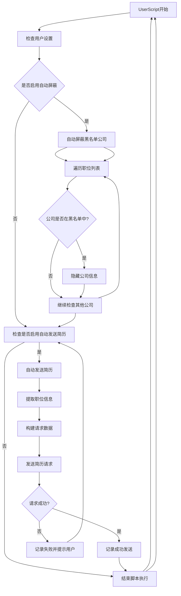

检查用户设置，确定是否启用了自动屏蔽黑名单公司或自动发送简历功能。
如果启用了自动屏蔽，脚本将遍历职位列表，并检查每个公司的名称是否在黑名单中。
如果公司在黑名单中，脚本将隐藏该公司的信息。
如果公司不在黑名单中，脚本将继续检查其他公司。
如果启用了自动发送简历，脚本将提取职位信息，并构建请求数据。
脚本发送简历请求到招聘网站。
根据请求结果，脚本记录成功发送的职位或记录失败的职位并提示用户。
